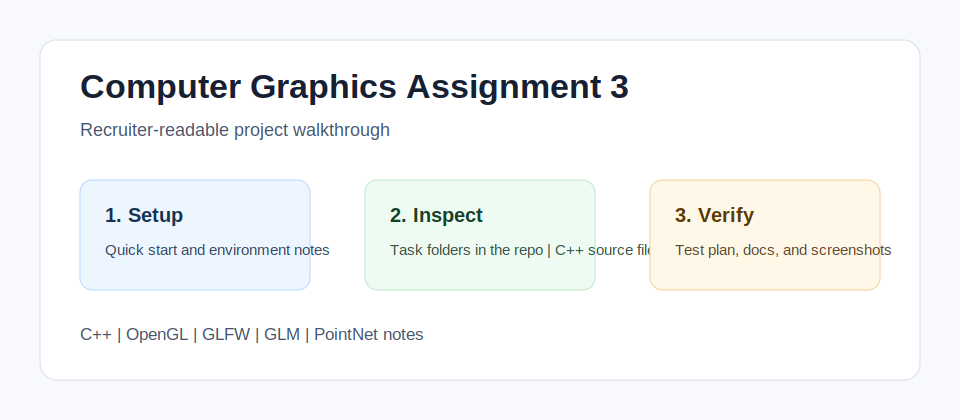

<!-- bettergithub:generated-readme -->
# Computer Graphics Assignment 3

Computer Graphics Assignment 3 demonstrates interactive graphics work in C++ through an OpenGL Rubik's Cube task and a PointNet-related exploration. The repo helps reviewers see how rendering, transformations, input handling, and graphics-course experimentation were organized into a reproducible assignment submission with clear build notes and inspection guidance.

## Tech Stack

- C++
- OpenGL
- GLFW
- GLM
- PointNet notes
- GitHub Actions

## Quick Start

```bash
Review the assignment folders and source files.
Install the course graphics dependencies listed in the assignment handout.
Build the relevant C++ target from the assignment folder.
```

## Usage

- Run the OpenGL task locally from the assignment folder.
- Use the README and docs as a map for the two assignment tasks.
- Capture screenshots of the cube or PointNet output when rerunning the project.

## Environment Variables

No .env file or API key is required. A local C++ compiler and the course graphics libraries are the only expected configuration.

## Demo and Screenshots



The diagram above is a lightweight walkthrough image for GitHub reviewers. It shows the reviewer path, the implementation areas to inspect, and the evidence this repository provides. For non-web course projects, this replaces a live demo with reproducible local setup and manual verification notes.

## Testing and Quality

Testing is documented even when the original assignment uses manual verification instead of a full automated suite.

```bash
Manual test: build the assignment target, run the executable, and verify the documented controls and rendered output.
```

See [docs/test-plan.md](docs/test-plan.md) for the manual or automated checks that should be used before presenting this repository.

## Repository Structure

- `Task folders in the repo`
- `C++ source files`
- `docs`

## Architecture Notes

This is a course graphics repo. The implementation is kept in its original assignment layout, while the added docs describe the rendering responsibilities, setup assumptions, manual tests, and expected reviewer path.

See [docs/architecture.md](docs/architecture.md) for a more detailed reviewer map.

## Recruiter Notes

- The README opens with the project purpose, audience, and result so the repository is scannable.
- Setup, environment, usage, testing, and architecture notes are collected in predictable sections.
- Existing source code was not changed by the documentation polish pass.

## Roadmap

- Add a short result screenshot or terminal capture after the project is rerun locally.
- Add one small automated smoke test if the course/tooling environment makes it practical.
- Keep the README aligned with the latest verified run command.

## Existing Project Notes

# Computer Graphics – Assignment 3

**Rubik's Cube (OpenGL/C++) + PointNet (Python/ShapeNet)**

This repository contains the solution for Assignment 3: **Task 1** – interactive Rubik's Cube in C++ with OpenGL, and **Task 2** – PointNet with the ShapeNet point cloud dataset in a Jupyter notebook.

---

## Task 1 – Rubik's Cube (OpenGL, C++)

### Overview
Render a dynamic Rubik's cube using OpenGL in C++ with perspective camera, textured cubes, and full interaction.

### Main requirements
- **Scene:** Perspective camera (FOV 45°), cube mesh with `plane.png` texture, 26/27 cubes arranged as a Rubik's cube.
- **Data structures:** Track position, rotation, and translation of each cube; support wall rotations by shape index.
- **Keyboard:** R, L, U, D, B, F (wall rotations), Space (flip direction), Z (angle ÷2), A (angle ×2).
- **Mouse:** Left drag = rotate whole cube (Y/X); right drag = pan camera; scroll = zoom. P = toggle Color Picking.
- **Color Picking:** Pick a single cube; right-click = translate (Z-buffer); left-click = rotate with camera view.
- **Robustness:** Cube structure must remain valid after multiple wall rotations; breaking is allowed only in Picking mode.

### Build & run
- Open the Task 1 project in your IDE, build the OpenGL project, and run. Ensure `plane.png` and assets are in the correct path.

---

## Task 2 – PointNet + ShapeNet

### Overview
Set up the PointNet model and ShapeNet point cloud dataset, run the provided Jupyter notebook locally (or in Colab), and optionally perform dataset preparation and analysis tasks.

### Project setup (from assignment)

1. **Folder structure** (e.g. `PointNet` or `PointNet_solved`):
   - **Notebook:** PointNet + ShapeNet notebook (e.g. `pointnet_shapenet_dataset.ipynb`).
   - **Dataset:** ShapeNet Core – unzip to `shapenet-core-seg/<unzipped-content>` (e.g. `Shapenetcore_benchmark/`).
   - **Scripts:** Lidar utility scripts – unzip to `lidar-od-scripts/<unzipped-content>` (must include `gpuVersion/gpuVersion/` with `visual_utils.py`).

2. **Environment**
   - Python 3.10.x suggested (tested also on 3.13).
   - Install: `numpy>=1.21.0`, `torch>=1.9.0`, `matplotlib>=3.4.0`, `plotly>=5.0.0`, `tqdm>=4.62.0`.
   - Install Jupyter if you run the notebook from the command line: `pip install jupyter nbconvert`.

3. **Paths**
   - The notebook uses **auto-detection**: if `/content/PointNet` does not exist (e.g. on your PC), it uses the current working directory or `PointNet_solved` / `Task2-PointNet/PointNet_solved` so that `shapenet-core-seg` and `lidar-od-scripts` are found. Run the notebook with the working directory set to the folder that contains `shapenet-core-seg` and `lidar-od-scripts`.

### Dataset preparation (assignment Part 2)

- Create a **subset** of ShapeNet: 5–6 categories with at least 100 samples each (e.g. Airplane 1958).
- Use `synsetoffset2category.txt` for folder–category mapping.
- Per category: randomly choose 100–150 samples (pairs of `.npy` and `.seg`), copy into subset folders.
- **Splits:** 70% train, 10% val, 20% test, kept per category and overall (e.g. 70/10/20 per 100 samples per class).
- Train PointNet on this subset; you may increase epochs to improve accuracy.

### Analysis tasks (assignment Part 3 – choose 2 of 3)

For each chosen task, show: one sample visualization, NLL loss, and **accuracy** (correct / total), then a short written summary.

- **3.1 – Feature importance:** Subset 1: drop one dimension (e.g. orthographic (x,y) or (y,z)); Subset 2: random rotation + perspective on one dimension. Train/test PointNet on each and analyze.
- **3.2 – Architecture:** Compare global max vs local avg; change MLP sizes (e.g. 32, 64, 512), add layers, LeakyReLU, max vs average pooling. Also analyze T-Net: same class, 3+ samples, show original vs PointNet T-Net transforms (applied then visualized).
- **3.3 – Sampling:** Six subsets: 3 with Voxel downsampling (10%, 30%, 50% points dropped), 3 with Uniform downsampling (10%, 30%, 50%). Adjust points per shape (e.g. 2250 for 10% drop). Train/test per subset; optionally compare max vs average vs top-k pooling.

---

---

